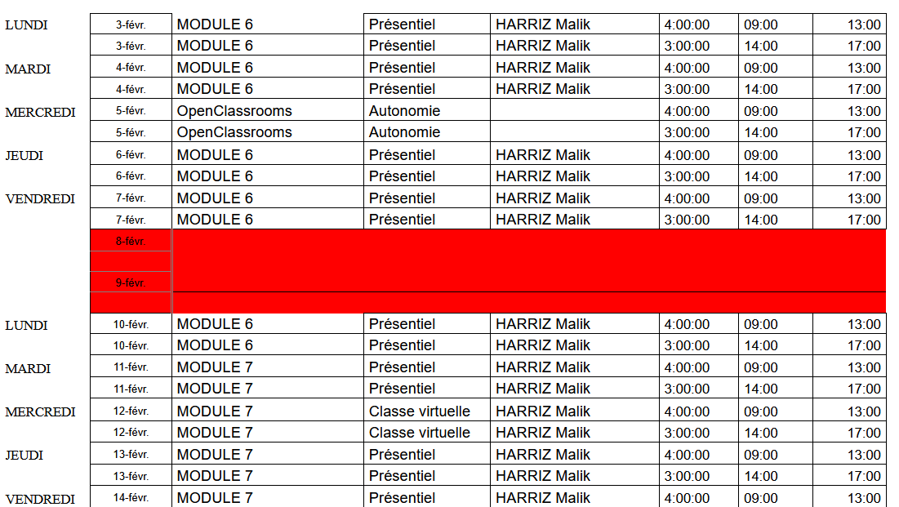

Courriel du 4 novembre 2024 :

Chers stagiaires, voici comme convenu l'emploi du temps jusqu'à Noël !

Bien sûr, pour toute modification, vous serez informés.

Bienvenue officiellement en Titre Pro DWWM !

LUNDI 	4-nov. 	Accueil 	Présentiel 	COORDO 	2:00:00 	10:00 	12:00
  	4-nov. 	MODULE 1 	Présentiel 	HARRIZ Malik 	4:00:00 	13:00 	17:00
MARDI 	5-nov. 	MODULE 1 	Présentiel 	HARRIZ Malik 	4:00:00 	09:00 	13:00
  	5-nov. 	MODULE 1 	Présentiel 	HARRIZ Malik 	3:00:00 	14:00 	17:00
MERCREDI 	6-nov. 	MODULE 1 	Classe virtuelle 	HARRIZ Malik 	3:00:00 	09:00 	12:00
  	6-nov. 	MODULE 1 	Classe virtuelle 	HARRIZ Malik 	4:00:00 	14:00 	18:00
JEUDI 	7-nov. 	Cohésion de groupe 	Présentiel 	COURTINAT Bénédicte 	4:00:00 	09:00 	13:00
  	7-nov. 	Accompagnement emploi 	Présentiel 	COURTINAT Bénédicte 	3:00:00 	14:00 	17:00
VENDREDI 	8-nov. 	MODULE 1 	Présentiel 	HARRIZ Malik 	4:00:00 	09:00 	13:00
  	8-nov. 	MODULE 1 	Présentiel 	HARRIZ Malik 	3:00:00 	14:00 	17:00
  	9-nov. 	  	  	  	  	  	 
  	  	  	  	  	  	  	 
  	10-nov. 	  	  	  	  	  	 
  	  	  	  	  	  	  	 
LUNDI 	11-nov. 	FERIE 	  	  	 
  	11-nov. 	  	  	 
MARDI 	12-nov. 	MODULE 2 	Présentiel 	DELORME Christian 	4:00:00 	09:00 	13:00
  	12-nov. 	MODULE 2 	Présentiel 	DELORME Christian 	3:00:00 	14:00 	17:00
MERCREDI 	13-nov. 	OpenClassrooms 	Autonomie 	  	4:00:00 	09:00 	13:00
  	13-nov. 	OpenClassrooms 	Autonomie 	  	3:00:00 	14:00 	17:00
JEUDI 	14-nov. 	MODULE 2 	Présentiel 	DELORME Christian 	4:00:00 	09:00 	13:00
  	14-nov. 	MODULE 2 	Présentiel 	DELORME Christian 	3:00:00 	14:00 	17:00
VENDREDI 	15-nov. 	MODULE 2 	Présentiel 	DELORME Christian 	4:00:00 	09:00 	13:00
  	15-nov. 	MODULE 2 	Présentiel 	DELORME Christian 	3:00:00 	14:00 	17:00
  	16-nov. 	  	  	  	  	  	 
  	  	  	  	  	  	  	 
  	17-nov. 	  	  	  	  	  	 
  	  	  	  	  	  	  	 
LUNDI 	18-nov. 	MODULE 1 	Présentiel 	HARRIZ Malik 	4:00:00 	09:00 	13:00
  	18-nov. 	MODULE 1 	Présentiel 	HARRIZ Malik 	3:00:00 	14:00 	17:00
MARDI 	19-nov. 	MODULE 1 	Présentiel 	HARRIZ Malik 	4:00:00 	09:00 	13:00
  	19-nov. 	MODULE 1 	Présentiel 	HARRIZ Malik 	3:00:00 	14:00 	17:00
MERCREDI 	20-nov. 	OpenClassrooms 	Autonomie 	  	4:00:00 	09:00 	13:00
  	20-nov. 	OpenClassrooms 	Autonomie 	  	3:00:00 	14:00 	17:00
JEUDI 	21-nov. 	MODULE 1 	Présentiel 	HARRIZ Malik 	4:00:00 	09:00 	13:00
  	21-nov. 	MODULE 1 	Présentiel 	HARRIZ Malik 	3:00:00 	14:00 	17:00
VENDREDI 	22-nov. 	MODULE 1 	Présentiel 	HARRIZ Malik 	4:00:00 	09:00 	13:00
  	22-nov. 	MODULE 1 	Présentiel 	HARRIZ Malik 	3:00:00 	14:00 	17:00
  	23-nov. 	  	  	  	  	  	 
  	  	  	  	  	  	  	 
  	24-nov. 	  	  	  	  	  	 
  	  	  	  	  	  	  	 
LUNDI 	25-nov. 	MODULE 2 	Présentiel 	DELORME Christian 	4:00:00 	09:00 	13:00
  	25-nov. 	MODULE 2 	Présentiel 	DELORME Christian 	3:00:00 	14:00 	17:00
MARDI 	26-nov. 	MODULE 2 	Présentiel 	DELORME Christian 	4:00:00 	09:00 	13:00
  	26-nov. 	MODULE 2 	Présentiel 	DELORME Christian 	3:00:00 	14:00 	17:00
MERCREDI 	27-nov. 	MODULE 2 	Classe virtuelle 	DELORME Christian 	3:00:00 	09:00 	12:00
  	27-nov. 	MODULE 2 	Classe virtuelle 	DELORME Christian 	4:00:00 	13:00 	17:00
JEUDI 	28-nov. 	MODULE 3 	Présentiel 	DELORME Christian 	4:00:00 	09:00 	13:00
  	28-nov. 	MODULE 3 	Présentiel 	DELORME Christian 	3:00:00 	14:00 	17:00
VENDREDI 	29-nov. 	MODULE 3 	Présentiel 	DELORME Christian 	4:00:00 	09:00 	13:00
  	29-nov. 	MODULE 3 	Présentiel 	DELORME Christian 	3:00:00 	14:00 	17:00
  	30-nov. 	  	  	  	  	  	 
  	  	  	  	  	  	  	 
  	1-déc. 	  	  	  	  	  	 
  	  	  	  	  	  	  	 
LUNDI 	2-déc. 	MODULE 3 	Présentiel 	DELORME Christian 	4:00:00 	09:00 	13:00
  	2-déc. 	MODULE 3 	Présentiel 	DELORME Christian 	3:00:00 	14:00 	17:00
MARDI 	3-déc. 	MODULE 3 	Présentiel 	DELORME Christian 	4:00:00 	09:00 	13:00
  	3-déc. 	MODULE 3 	Présentiel 	DELORME Christian 	3:00:00 	14:00 	17:00
MERCREDI 	4-déc. 	OpenClassrooms 	Autonomie 	  	4:00:00 	09:00 	13:00
  	4-déc. 	OpenClassrooms 	Autonomie 	  	3:00:00 	14:00 	17:00
JEUDI 	5-déc. 	MODULE 3 	Présentiel 	DELORME Christian 	3:00:00 	09:00 	12:00
  	5-déc. 	MODULE 3 	Présentiel 	DELORME Christian 	4:00:00 	13:00 	17:00
VENDREDI 	6-déc. 	MODULE 3 	Présentiel 	DELORME Christian 	4:00:00 	09:00 	13:00
  	6-déc. 	MODULE 3 	Présentiel 	DELORME Christian 	3:00:00 	14:00 	17:00
  	7-déc. 	  	  	  	  	  	 
  	  	  	  	  	  	  	 
  	8-déc. 	  	  	  	  	  	 
  	  	  	  	  	  	  	 
LUNDI 	9-déc. 	MODULE 3 	Présentiel 	DELORME Christian 	4:00:00 	09:00 	13:00
  	9-déc. 	MODULE 3 	Présentiel 	DELORME Christian 	3:00:00 	14:00 	17:00
MARDI 	10-déc. 	Accompagnement emploi 	Présentiel 	COURTINAT Bénédicte 	4:00:00 	09:00 	13:00
  	10-déc. 	Accompagnement emploi 	Présentiel 	COURTINAT Bénédicte 	3:00:00 	14:00 	17:00
MERCREDI 	11-déc. 	OpenClassrooms 	Autonomie 	  	4:00:00 	09:00 	13:00
  	11-déc. 	OpenClassrooms 	Autonomie 	  	3:00:00 	14:00 	17:00
JEUDI 	12-déc. 	MODULE 3 	Présentiel 	DELORME Christian 	4:00:00 	09:00 	13:00
  	12-déc. 	MODULE 3 	Présentiel 	DELORME Christian 	3:00:00 	14:00 	17:00
VENDREDI 	13-déc. 	MODULE 3 	Présentiel 	DELORME Christian 	4:00:00 	09:00 	13:00
  	13-déc. 	MODULE 3 	Présentiel 	DELORME Christian 	3:00:00 	14:00 	17:00
  	14-déc. 	  	  	  	  	  	 
  	  	  	  	  	  	  	 
  	15-déc. 	  	  	  	  	  	 
  	  	  	  	  	  	  	 
LUNDI 	16-déc. 	MODULE 4 	Présentiel 	DELORME Christian 	4:00:00 	09:00 	13:00
  	16-déc. 	MODULE 4 	Présentiel 	DELORME Christian 	3:00:00 	14:00 	17:00
MARDI 	17-déc. 	MODULE 4 	Présentiel 	DELORME Christian 	4:00:00 	09:00 	13:00
  	17-déc. 	MODULE 4 	Présentiel 	DELORME Christian 	3:00:00 	14:00 	17:00
MERCREDI 	18-déc. 	Anglais 	Classe virtuelle 	SUAREZ Elisabeth 	4:00:00 	09:00 	13:00
  	18-déc. 	OpenClassrooms 	Autonomie 	  	3:00:00 	14:00 	17:00
JEUDI 	19-déc. 	MODULE 4 	Présentiel 	DELORME Christian 	4:00:00 	09:00 	13:00
  	19-déc. 	MODULE 4 	Présentiel 	DELORME Christian 	3:00:00 	14:00 	17:00
VENDREDI 	20-déc. 	MODULE 4 	Présentiel 	DELORME Christian 	4:00:00 	09:00 	13:00
  	20-déc. 	MODULE 4 	Présentiel 	DELORME Christian 	3:00:00 	14:00 	17:00

